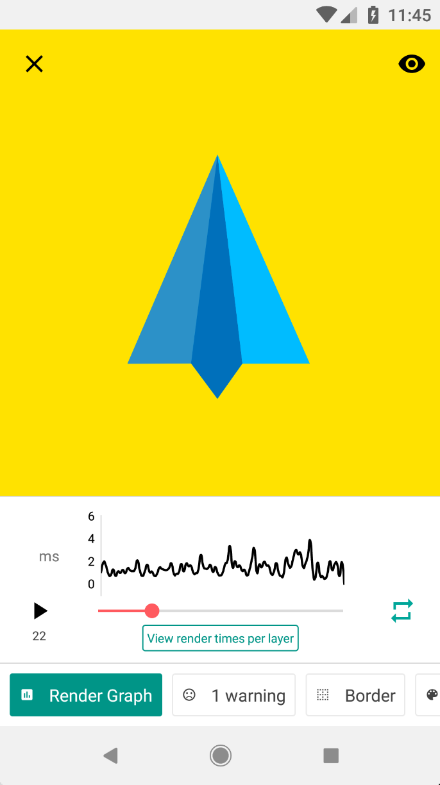
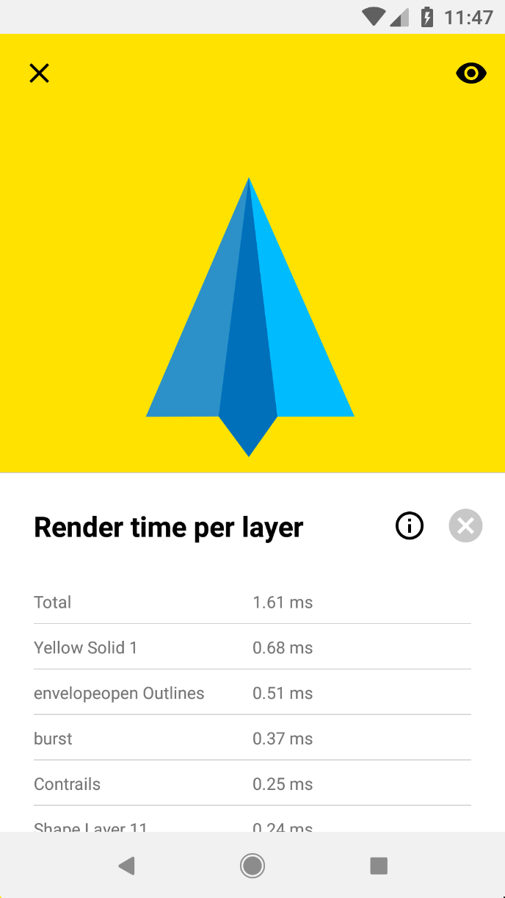
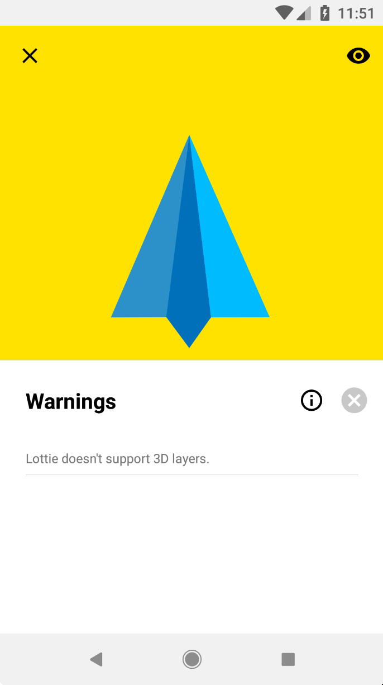

## Lottie for Android - Advanced 4

Airbnb의 애니메이션 지운 라이브러리인 [Lottie](http://airbnb.io/lottie/#/README)에서 안드로이드 관련 문서를 번역하고 정리해보려 한다. 

1. [Lottie for Android - Lottie란 무엇인가](https://github.com/ksu3101/TIL/blob/master/Android/200904_android.md)
2. [Lottie for Android - Basic](https://github.com/ksu3101/TIL/blob/master/Android/200905_android.md)
3. [Lottie for Android - Advanced 1](https://github.com/ksu3101/TIL/blob/master/Android/200906_android.md)
4. [Lottie for Android - Advanced 2](https://github.com/ksu3101/TIL/blob/master/Android/200907_android.md)
5. [Lottie for Android - Advanced 3](https://github.com/ksu3101/TIL/blob/master/Android/200910_android.md)
6. Lottie for Android - Advanced 4

### 1. 성능 (Performance)

#### 1.1 마스크와 매트(Matte)

Android에서 마스크와 매트는 성능이 크게 떨어진다. 성능 저하는 마스크/매트 레이어와 마스크/매트의 교차 경계에도 비례하므로 마스크/매트가 작을 수록 성능 저하가 적다. Android에서는 마스크 또는 매트를 사용하는 경우 하드웨어 가속을 사용할때 몇가지 성능 향상이 있다. 

#### 1.2 하드웨어 가속

Lottie는 하드웨어 가속을 지원하지만 즉시 사용할 수 없다. 하드웨어 가속에 대해 자세히 알아보려면 [이 기사](https://developer.android.com/guide/topics/graphics/hardware-accel.html)를 읽어보는것을 추천한다. 하드웨어 가속은 안티 앨리어싱(anti-aliasing), 스트로크 캡(stroke cap)-(API18 이전)및 기타 몇가지 사항을 지원하지 않기 때문에 기본적으로 비활성 되어 있다. 또한 애니메이션에 따라 실제로 성능이 떨어질 수 있다. 이유를 이해하려면 [이 기사](http://blog.danlew.net/2015/10/20/using-hardware-layers-to-improve-animation-performance/)를 읽어보는 것을 추천 한다. 

애니메이션에 성능 문제가 있는 경우 먼저 [성능](http://airbnb.io/lottie/#/android/performance)문서를 읽도록 하자. 벤치마킹 하는 방법과 애니메이션이 하드웨어 가속의 혜택을 받을 수 있는지 결정하는 방법에 대한 자세한 정보가 있다. 

#### 1.3 경로 병합 (Merge paths)

경로 병합은 안드로이드 KitKat이상에서만 지원 한다. [Path.Op](https://developer.android.com/reference/android/graphics/Path.html#op(android.graphics.Path,%20android.graphics.Path.Op)가 느릴 수 있기 때문에 사용시 약간의 성능 오버 헤드가 존재할 수 있다. 개발자가 경로 병합이 활성화된 새 장치에서 테스트하는 것 을 방지하기 위해 이전 장치의 사용자에게 깨진 환경을 제공하는 동안 기본적으로 비활성화 된다. `minSdk`가 19 보다 크거나 같다면 `enableMergePathsForKitKatAndAbove()`메소드를 사용하여 활성화 할 수있다. 

#### 1.4 Render Graph

Lottie샘플 앱 에서는 오른쪽 상단의 메뉴에서 활성화 할 수 있는 실시간 렌더링 그래프가 있다. 또한 프레임당 16.66및 33.333ms에 대한 지침이 있으며 이는 각각 60fps및 30fps에 도달하는 최대 렌더링 시간을 나타낸다. 

#### 1.5 레이어 당 렌더링 시간 (Render TImes per Layer)

Lottie 샘플 앱에는 각 레이어를 렌더링 하는데 걸린 시간이 표시된 하단 시트도 있다. 엑세스 하려면 컨트롤 막대에서 렌더링 그래프를 클릭 한 다음 "View render times per layer"를 탭 한다. 

특히 느린 레이어가 있는 경우 가능한 모양을 최적화하고 마스크, 매트 및 경로 병합을 제거 하도록 한다. 

#### 1.6 문제 해결 

Lottie가 애니메이션을 올바르게 렌더링하지 않는 경우가 있을 수 있다. After Effects에는 수많은 기능이 있지만 모두 Lottie에서 지원하는 것은 아니다. 애니메이션이 올바르지 않은 경우 문제를 보고하기 전에 아래와 같은 단계를 진행해보도록 하자. 

##### 1.6.1 경고 알림 확인 하기

Android의 Lottie는 일부 오류를 자동으로 감지하고 보고 한다. 모든 오류를 포착하진 않지만 일반적인 경우는 대부분 포착하여 알려준다. `getWarnings()`메소드를 호출하거나 Lottie샘플 앱 에서 애니메이션을 열고 오른쪽 상단에 경고가 표시되는지 확인할 수 있다. 그렇다면 더 많은 정보들을 얻을 수 있다. 

##### 1.6.2 지원되는 기능에 대한 페이지를 확인 하기

[지원 기능 페이지](http://airbnb.io/lottie/#/supported-features)를 확인 하여 지원되지 않는 기능을 사용중인건 아닌지 확인 한다. 

##### 1.6.3 디버깅 

애니메이션의 개별 부분을 렌더링 하여 올바르게 렌더링 되지 않는 기능을 확인한다. 모양(Shape)와 효과(effects)의 특정 조합 또는 "잘 보이지 않음"보다 더 구체적인 것 으로 범위를 좁힐 수 있는지 확인 하자. 문제가 지원되어야 하지만 그렇지 않은 경우 적절한 lottie github페이지에 aep파일의 설명 및 zip과 함께 문제를 제출하도록 한다. 

##### 1.6.4 누락된 경로 병합

경로 병합은 KitKat버전 이상에서만 사용할 수 있으므로 `enableMergeParthsForKitKatAndAbove()`메소드를 사용하여 수동으로 활성화 해 주어야 한다. 

##### 1.6.5 Animation clipping

최신버전의 Lottie를 사용하고 있는지 버전을 확인 한다. 
