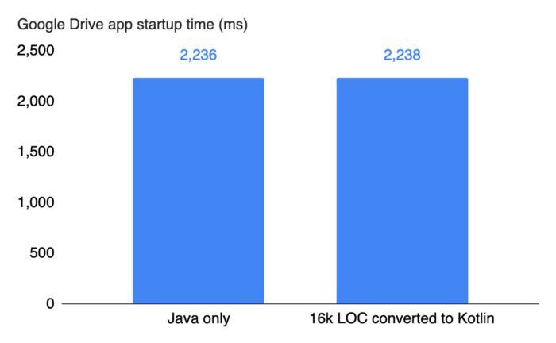
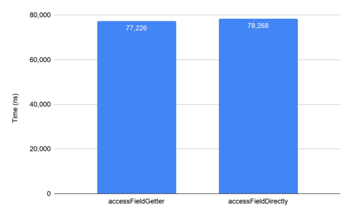

## 안드로이드 퍼포먼스에 대한 팩트 체크

이 글은 Calin Juravle의 [Busting Android performance myths](https://medium.com/androiddevelopers/busting-android-performance-myths-d85ae1d87f22)를 번역 하였다. 

- myth를 미신과 같이 번역해도 괜찮은데 개발적인 의미에서 범위가 넓다고 느껴져서 최근 자주 사용되는 은어인 "팩트"로 사용 해 보았다. 

### 들어가며 

수년동안 Android의 성능에 대하여 몇가지 검증되지 않은 이야기들이 있어왔었다. 일부는 재미있을 법한 흥미로운 이야기 일 수도 있지만, 고성능의 안드로이드 앱을 만드려 할 때 잘못된 개발 방향으로 유도하는 것은 전혀 재미가 없어질 것 이다. 

이 게시글에서는 MythBusters(도시신화나 미신들을 실제 기술로 테스팅 하고 검증하여 진실인지 아닌지 여부를 확인하는 TV 프로그램)의 정신으로 이러한 팩트들에 대해서 테스트 할 것이다. 그래서 팩트에 대해 검증하기 위해 사용할 수 있는 실제 사례들과 도구들을 사용 할 것이다. 이 글에서는 지배적인(dominant) 사용 패턴에 대해 초점을 맞추게 되어 앱에 대해 개발하는 내용들에 초점을 맞추게 될 것 이다. 

이제 팩트에 대한 검증을 시작하도록 해 보자!

### 팩트 체크 1: 코틀린으로 작성된 앱은 자바 보다 용량이 더 크고 느리다? 

Google드라이브 팀은 드라이브 앱을 기존 자바에서 코틀린으로 전환하는 작업을 거쳤다. 이 전환 작업에서만 40개 이상의 빌드 대상을 포함하는 170개 이상의 파일과 16,000줄 이상의 코드가 포함되어 있다. 팀은 전환후 모니터링할 대상중 하나로 그 중 첫번째는 앱의 구동 시간 이었다. 



- 이미지의 그래프 설명 : 구글 드라이브 앱의 구동까지의 시간 (좌, 자바로만 작성된 코드), (우, 코틀린으로 작성된 코드)

위 그래프에서 보다시피 코틀린으로 전환된 코드는 실질적으로 구동시간에 영향을 주지 않았다. 

실제로 앱의 전체 벤치 마크에서 팀은 코틀린 전환으로 인한 성능차이를 관찰하지 못했다. 컴파일 시간과 컴파일된 코드의 크기가 약간 증가하기는 하였지만 약 2%내 에서는 큰 영향이 없었다. 

코틀린으로 전환하면서 얻은 이익을 말하자면 팀은 코드라인을 25%줄였다. 이제 코드는 한층 더 깨끗하고 명확하며 유지 관리가 쉬워졌다. 

코틀린에 대해 주목해야 할 점은 R8과 같은 코드 축소 도구(code shrinking tools)를 사용할 수 있다는 것 이다. 이 도구는 코틀린에 대한 특정된 최적화 기능이 포함되어 있다. 

### 팩트 체크 2: (클래스 필드의) Getter와 Setter는 (public 접근자에 비해 성능적으로) 비효율적이다? 

일부 개발자는 성능상의 이유로 setter와 getter를 사용하는 대신 public으로 공개된 필드를 사용 한다. 일반적인 코드 패턴은 아래와 같으며 `getFoo()`를 getter로 사용 한다. 

```java
public class ToyClass {
   public int foo;
   public int getFoo() { return foo; }
}
ToyClass tc = new ToyClass();
```

위 내용을 공개 필드인 `tc.foo`를 직접 접근하여 사용 하는것 과 비교해보도록 하자. 여기에서 코드는 필드에 직접 접근하기 위해서 객체의 캡슐화를 하지 않게 된다. 

작성자는 Android 10이 설치된 Pixel 3에서 Jetpack benchmark라이브러리를 사용하여 이를 벤치마킹 해 보았다. 이 벤치마크 라이브러리는 개발한 코드에 대해 쉽게 테스트 할 수 있는 좋은 방법들을 제공 한다. 라이브러리의 기능 중 하나는 코드를 예열(prewarms) 하므로 결과를 안정적인 수치로 알려준다.

그렇다면 벤치마크를 통해서 얻은 결과는 무엇일까? 



- 이미지의 그래프 설명 : 좌, 클래스 필드에 대해 getter로 접근했을때 걸리는 시간 - 우, public으로 오픈된 클래스 필드에 직접 접근하는데 걸리는 시간 

벤치마크 테스트 에서는, getter와 public 필드에 직접 접근하는 두 방법 모두 같은 방식으로 수행 된다. 결과를 보면 안드로이드 런타임(ART)이 코드의 모든 사소한 액세스 방법에 대해 인라인(inlines)해주므로 놀라운 결과는 아니다. 따라서 JIT또는 AOT컴파일 후 실행되는 코드는 동일하다고 봐도 무방하다. 실제로 코틀린의 필드(위의 예제 에서는 `tc.foo`)에 접근 하면 컨텍스트에 따라 getter또는 setter를 통해 해당 값 또는 참조의 값에 접근 하게 된다. 그러나 모든 접근자들에 대해 ART가 인라인 하기 때문에 성능에는 차이가 없다.  

- [JIT](https://source.android.com/devices/tech/dalvik/jit-compiler?hl=ko)
  - `Just In Time`의 약자로 앱이 실행되는 순간 바이트 코드를 컴파일. 
  - 앱이 실행되거나 화면이 전환시 필요한 코드를 실시간 컴파일링 하기 때문에 그 시간동안 레이턴시가 발생할 수 있다. 
  - 컴파일이 빈번하게 발생하므로 시스템 자원(Ram, CPU, 배터리 등)에 대한 점유가 크다. 
  - AOT에 비해 앱의 설치 시간이 빠르고 앱 용량이 적다. 
- AOT
  - `Ahead Of Time`의 약자로 안드로이드 KitKat버전에서부터 등장한 컴파일러. 
  - 앱 설치할때만 모든 코드를 컴파일한뒤 실행 한다. 
  - 앱 실행시 컴파일을 하지 않기 때문에 JIT보다 런타임 시점에서의 레이턴시는 없다. 
  - JIT에 비해 앱 설치속도가 느리다. 
  - 미리 컴파일을 하기 때문에 앱의 용량이 JIT에 비해 상대적으로 크다. 

코틀린을 사용하지 않는 경우 클래스의 필드를 공개해야 하는 타당한 이유가 없다면 캡슐화를 위반해서는 안된다. 클래스의 필드는 private로 데이터를 숨겨 캡슐화를 하는게 유용하며 성능상의 이유로 노출 할 필요는 없다. 그러므로 getter와 setter를 통해 클래스의 필드는 숨기는 게 맞다. 

### 팩트 체크 3: 람다(Lambda)는 내부 클래스(Inner class)보다 느리다? 

스트리밍(streaming) API가 도입된 후 람다(Lambda)는 매우 간결한 코드를 작성할 수 있게 도와주는 편리한 언어 구조 이다. 객체로 이루어진 배열에서 내부의 일부 원소 값을 합산하는 예제 코드를 살펴 보면 첫째로, map-reduce 작업과 함께 스트리밍 API를 사용함을 알 수 있다. 

```java
ArrayList<ToyClass> array = build();
int sum = array.stream().map(tc -> tc.foo).reduce(0, (a, b) -> a + b);
```

여기에서 첫번째 람다는 객체를 정수로 반환 한하고 두번째 람다는 생성된 두 값을 합산 하여 반환한다. 이는 람다 식에 대해 동등한 클래스를 정의하는 것 과 비교할 수 있다. 

```java
ToyClassToInteger toyClassToInteger = new ToyClassToInteger();
SumOp sumOp = new SumOp();
int sum = array.stream().map(toyClassToInteger).reduce(0, sumOp);
```

다음 예제로 두개의 중첩 클래스(nested class)가 있다. 하나는 객체를 정수로 변환하는 `toyClassToInteger`이고, 두번째 클래스는 합 연산을 하는 `SumOp`이라는 클래스 이다. 첫번째 예제 람다는 두번째 람다보다 훨씬 더 깔끔 하고 보기에 좋다. 대부분의 개발자들은 첫번째 람다와 같은 방법을 사용 할 것 이라고 할 것 이다. 

그러나 이 둘의 성능 차이는 어떨까? 다시 한번 Android 10이 설치된 Pixel 3에서 Jetpack Benchmark 라이브러리를 사용하여 성능 차이를 확인 하였지만 별다른 성능 차이가 없음을 확인 할 수 있었다. 


- 이미지 그래프 설명
  - `topLevelClass` : 최상위 클래스를 재정의 하여 테스트 
  - `nestedClass` : 중첩된 클래스를 이용한 구현 
  - `lambda` : 람다를 이용한 구현

그래프를 통해서 최상위 클래스를 정의한 것을 볼 수 있으며 이런 구현 방법을 통해서도 성능차이가 없음을 확인 하였다. 

이러한 성능차이가 없는 이유는 람다가 익명의 내부 클래스로 변환되기 때문이다. 따라서, 내부 클래스를 작성하는 대신 람다를 사용 하는게 좋다. 실제 람다는 내부 클래스로 변환되기 때문에 중첩된 내부 클래스와 성능이 거의 동일할수 밖에 없으며 또한 코드가 간결하고 직관성이 좋아 깔끔한 코드를 만들어 내기에 좋다. 

### 팩트 체크 4: 객체의 할당은 비효율적이니, 객체 풀(pool)을 사용 해야 한다? 

### 팩트 체크 5: 디버깅용 앱을 프로파일링 하여 측정 해도 문제 없다? 

### 잘 알려지지 않은 낯선 것 들

#### 1. `Multidex`는 앱의 성능에 영향을 주는가? 

#### 2. Dead code

### 결론 
