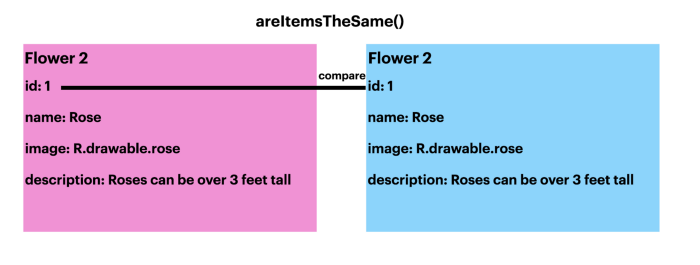

## Adapting to ListAdapter

> 이 문서는 Meghan Mehta가 작성한 [Adapting to ListAdapter](https://medium.com/androiddevelopers/adapting-to-listadapter-341da4218f5b)를 번역 하였다. 

`RecyclerView`는 데이터의 항목 목록을 효율적으로 표현하기 위한 좋은 방법이다. 정적인 데이터 목록을 화면에 표시하려면 기본 어댑터를 사용하면 훌륭하게 작동할 것 이다. 그러나 대부분의 RecyclerView를 사용하는 사례에서의 데이터는 대부분 동적이다. 예를 들어 "할 일"목록을 보여주는 목록 앱을 살펴 보도록 하자. 이 경우 새 할일 항목이 추가되고 완료된 할 일 항목이 제거될 것 이다. 

`notifyItemInserted()`는 지정된 인덱스에 새 "할 일"작업을 삽입할 수 있지만 다른 항목을 제거할 때 문제가 발생한다. `notifyItemRemoved()`는 제거하려는 항목의 인덱스가 있는 경우에만 유효하다. 제거할 항목의 위치를 가져오는 코드를 작성한 다음 `notifyItemRemoved()`를 호출 할 수 있지만 이 코드는 지저분해 질 수밖에 없다. 

`notifyDataSetChanged()`호출은 필수는 아니지만 변경되지 않은 부분에 대해서도 전체 뷰를 다시 그리게 해 준다. 이는 당연히 비용이 많이 들어갈 수 밖에 없다. `ListAdapter`는 전체 뷰 를 다시 그릴 필요 없이 항목의 추가 및 제거를 처리 하고 이러한 변경사항에 대해 애니메이션을 적용할 수 있다. 

`ListAdapter`를 사용할 떄 다른 이점은 항목이 추가되거나 제거 될 때 애니메이션이 제공 된다는 것 이다. 이것은 사용자가 목록의 변경 사항을 확인할 수 있는 멋진 시각적인 효과를 제공 한다. 애니메이션은 `ListAdapter`가 없어도 적용할 수 있지만 개발자가 따로 구현해 주어야 하며 애니메이션과 함께 뷰를 다시 그려야 하기 때문에 ListAdapter보다 나은 성능을 기대하기 어렵다. 

### 1. Split the difference

`DiffUtil`은 `ListAdapter`가 목록의 항목을 효율적으로 변경할 수 있도록 하는 숨겨진 요소 이다. `DiffUtil`은 새 목록을 이전 목록과 비교하여 추가, 이동 및 제거 된 항목을 파악하고 첫 번째 목록을 두번째 목록으로 효율적으로 업데이트 해 준다. 

새 데이터를 식별하기 위해서 `DiffUtil`에서는 `areItemsTheSame()`및 `areConentsTheSame()`두개의 메소드를 재정의 해 주어야 한다. `areItemsTheSame()`은 두 항목이 실제로 동일한 항목인지 확인 한다. 그리고 `areContentsTheSame()`은 두 항목이 동일한 데이터인지 확인 한다. 



  - `areItemsTheSame() 에서는 두 항목이 동일한지만 검사 한다. 


  - `areContentsTheSame()`에서는 두 항목의 데이터가 동일한지를 검사 한다. 

`Adapter`클래스에서 `areItemsTheSame()`및 `areContentsTheSame()`을 재정의하는 `DiffUtil`객체를 만든다. 

```kotlin
object UserDiffCallback: DiffUtil.ItemCallback<User>() {
    override fun areItemsTheSame(oldItem: User, newItem: User): Boolean {
        return oldItem.id == newItem.id
    }

    override fun areContentsTheSame(oldItem: User, newItem: User): Boolean {
        return oldItem == newItem
    }
}
```

`RecyclerView.Adapter`대신 `ListAdapter`클래스를 상속하도록 만든 `Adapter`클래스의 상속구조를 변경 하고 생성자를 통해 구현한 `DiffCallBack`를 전달 한다. 

```kotlin
class UserListAdapter: ListAdapter<User, UserListAdapter.ViewHolder>(UserDiffCallback)
```

### 2. Updating the list

`ListAdapter`는 현재 목록과 비교 하여 표시할 항목을 제출하는 `submitList()`라는 메소드를 이용해 데이터를 세팅 한다. 즉, `ListAdapter`가 목록을 관리하므로 더 이상 `getItemCount()`를 재정의 할 필요가 없다. 

```kotlin
val userList = resources.getStringArray(R.array.user_array).toMutableList()
val userAdapter = UserListAdapter()
userAdapter.submitList(userList)
```

`Adapter`클래스에서 `onBindViewHolder()`는 이제 주어진 `position`을 이용해 `getItem()`을 사용하여 항목을 가져올 수 있다. 

```kotlin
override fun onBindViewHolder(holder: ViewHolder, position: Int) {
    holder.bind(getItem(position))
}
```

`RecyclerView`를 `ListAdapter`으로 사용하도록 변환하려면 몇단계만 거치면 된다. 이제 앱은 `ListAdapter`를 사용하여 변경된 항목만 업데이트하게 함 으로서 더 나은 성능과 좋은 사용자 경험을 제공할 수 있다. 

### 3. 예제 

> 이 부분은 원 게시글과 관련없는 추가 내용. 

개인적으로 토이 프로젝트에서 구현했었던 `ListAdapter`의 구현 예제이다. 예제에서는 우한 폐렴 코로나19바이러스의 현황을 보여주는 간단한 앱 으로서, 2개의 뷰 타입을 갖고 있고 데이터 바인딩을 사용해 각 뷰에선 필요한 데이터 인스턴스를 사용하도록 되어 있다. 

이 에제 코드는 [이 링크](https://github.com/ksu3101/PlayGround/blob/master/app/src/main/java/com/swkang/playground/view/covid19/Covid19StatusListAdapter.kt)에서 전체 코드를 확인 할 수 있다. 

#### 3.1 `DiffUtil` 

`DiffUtil`의 구현은 간단하다. `areItemsTheSame()`에서는 각 아이템의 `date`라는 날짜 정보를 기반으로 데이터의 일치를 구분 하며, `areContentsTheSame()`에서는 데이터의 내용 전부를 확인한다. 

```kotlin
val diffUtil = object : DiffUtil.ItemCallback<LocationCovid19Infos>() {
    override fun areItemsTheSame(
        oldItem: LocationCovid19Infos,
        newItem: LocationCovid19Infos
    ): Boolean {
      return oldItem.date == newItem.date
    }

    override fun areContentsTheSame(
        oldItem: LocationCovid19Infos,
        newItem: LocationCovid19Infos
    ): Boolean {
      return oldItem == newItem
    }
  }
```

#### 3.2 `ViewHolder`

`ViewHolder`는 2개를 갖는다. 

아래 `Covid19StatusTopViewHolder`는 목록의 탑 헤더 뷰와 데이터의 바인딩을 담당하고 있다. 이 뷰홀더에서는 상위 뷰모델인 `Covid19StatusViewModel`를 데이터 바인딩 객체로 필요로 하고 있다. 

```kotlin
class Covid19StatusTopViewHolder(
    private val binding: ViewDataBinding
) : RecyclerView.ViewHolder(binding.root) {
  companion object {
    fun create(parent: ViewGroup): Covid19StatusTopViewHolder {
      val layoutInflater = LayoutInflater.from(parent.context)
      val binding = DataBindingUtil.inflate<ViewDataBinding>(
        layoutInflater,
        R.layout.covid19status_item_top,
        parent,
        false
      )
      return Covid19StatusTopViewHolder(binding)
    }
  }

  fun bind(vm: Covid19StatusViewModel) {
    binding.setVariable(BR.vm, vm)
    binding.executePendingBindings()
  }
}
```

두번째 뷰홀더인 `Civud18StatusCountryViewHolder`는 각 데이터 항목을 보여주기 위해 `LocationCovid19Infos`인스턴스를 필요로 한다. 

```kotlin
class Civud18StatusCountryViewHolder(
    private val binding: ViewDataBinding
) : RecyclerView.ViewHolder(binding.root) {
  companion object {
    fun create(parent: ViewGroup): Civud18StatusCountryViewHolder {
      val layoutInflater = LayoutInflater.from(parent.context)
      val binding = DataBindingUtil.inflate<ViewDataBinding>(
        layoutInflater,
        R.layout.covid19status_item_country,
        parent,
        false
      )
      return Civud18StatusCountryViewHolder(binding)
    }
  }

  fun bind(covid19Location: LocationCovid19Infos) {
    binding.setVariable(BR.covid19Location, covid19Location)
    binding.executePendingBindings()
  }
}
```

#### 3.3 `ListAdapter`

`ListAdapter`의 구현은 아래와 같다. `position`에 따라 뷰타입을 분기 해 주는 `getItemViewType()`을 재정의 하였으며, 제공될 뷰타입에 따라 뷰홀더를 create해주고 bind해주는 메소드들을 재정의 했음을 확인 할 수 있다. 

```kotlin
class Covid19StatusListAdapter(
    private val vm: Covid19StatusViewModel
) : ListAdapter<LocationCovid19Infos, RecyclerView.ViewHolder>(diffUtil) {

  override fun onCreateViewHolder(parent: ViewGroup, viewType: Int): RecyclerView.ViewHolder {
    return when (viewType) {
      VIEWTYPE_TOP -> Covid19StatusTopViewHolder.create(parent)
      else -> Civud18StatusCountryViewHolder.create(parent)
      }
  }

  override fun onBindViewHolder(holder: RecyclerView.ViewHolder, position: Int) {
    if (holder is Covid19StatusTopViewHolder) holder.bind(vm)
    else if (holder is Civud18StatusCountryViewHolder) holder.bind(getItem(position))
  }

  override fun getItemViewType(position: Int): Int =
    when (position) {
      0 -> VIEWTYPE_TOP
      else -> VIEWTYPE_DEFAULT
    }
}
```

#### 3.4 그 외 

보면 알겠지만 `ListAdapter`와 `RecyclerView`는 데이터를 기반으로 뷰를 제공 한다. 그렇기 때문에 Top이나 각 아이템에 제공될 Header, Footer등의 뷰를 제공 하기 위해서는 실제 데이터 사이에 각 아이템이 끼어들어가야 할 필요성이 있다. 그렇기 때문에 뷰타입으로 제공될 인터페이스등으로 래핑하고 객체로 목록화 하여 제공 되어야 하는 불편함이 있다. 

이렇게 래핑된 객체로 제공 될 데이터들은 아무래도 포지션 관리에 어려움이 있을거 같기 때문에 더 좋은 방법이 있는지를 찾아봐야 할 거 같다. 