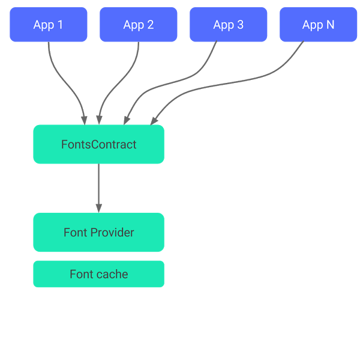
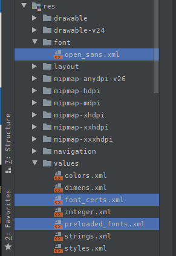

## 2 Best Ways To Use Custom Fonts In Android

> 이 글은 Vlad Sonkin의 [2 Best Ways To Use Custom Fonts In Android](https://vladsonkin.com/2-best-ways-to-use-custom-fonts-in-android/?utm_source=feedly&utm_medium=rss&utm_campaign=2-best-ways-to-use-custom-fonts-in-android)을 번역 하였다. 

어떠한 면 에서 모든앱들은 서로 다른 면을 가지고 있다. 제품 디자이너는 커스텀 뷰를 만들고, 정교한 애니메이션을 활용하고, 멋진 일러스트레이션을 그리는 방법등으로 다른 면을 제공 한다. 그리고 그 중에서도 앱의 모양과 폰트를 즉시 적용할 수 있는 두가지 방법이 있다. 이를 자세히 살펴보고 Android프로젝트에서 커스텀 폰트를 사용하는 좋은 방법들에 대해 살펴보도록 하자. 

### The Importance of Fonts

원본 글 작성자의 아내는 제품 디자이너이므로 폰트의 힘에 대해 여러번 확인한적 이 있었다. 올바른 폰트를 사용하면 사용자와 제품 간의 신뢰를 구축하고 프로세스를 더 쉽게 만들 수 있으며, 제품을 사용하는 동안 사용자에게 자신감을 줄 수 있다. 

다음은 간단한 예제 이다. 원본 글 작성자의 동료인 Ronald는 집을 구입하고 comic-sans폰트로 된 기술 문서를 받은적이 있다. 그 결과 일부분에서 집중해야 하는 부분에 있어 폰트로 인해 약간 혼란스러운적이 있었다. 

따라서 디자이너가 앱에서 폰트를 변경하고 싶을 때 그를 믿고 폰트를 적용하는것이 좋다. 운 좋게도 폰트를 적용하는 전체 프로세스는 간단 하며 이를 수행하는 두가지 방법이 있다. 

### Android Downloadable Fonts

다운로드 가능한 폰트는 매우 멋진 안드로이드의 기능 이다. 이 기능을 통해서 앱은 APK에 없는 커스텀 폰트를 사용 할 수 있다. 결과적으로 앱은 폰트 파일에 대한 용량을 차지 하지 않으므로 메모리를 덜 사용하게 되는 이점이 있어 사용자에게 탁월하다고 할 수 있다. 



간단히 말해서 Android에는 폰트와 함께 동작하는 폰트 공급자(Font provider)가 있으며 Google에 폰트를 요청하고 이를 사용할수 있게 해 준다. 

예를 들어 open-sans글꼴을 앱 프로젝트에 적용한다고 가정해보자. 다운로드 가능한 폰트를 적용하는 가장 쉬운 방법은 Android Studio를 사용하는 것 이다. 


Android Studio의 디자인 에디터 툴 에서 폰트를 적용하려는 `TextView`를 선택 하고 `Common Attributes`항목 중 `font-family`속성을 클릭 하고 나오는 폰트 목록중 가장 하단의 "More Fonts..."를 클릭 한다. 여기에서 Google 폰트 라이브러리에서 다운로드 할 수 있는 폰트의 목록을 확인 할 수 있다. 


open-sans를 찾아 선택하고 우측에서 "Create downloadable font"를 선택 하고 "OK"를 누른다. 이 시점에서 Android Studio는 이 글꼴에 필요한 모든파일(`open_sans.xml`, `font-certs.xml`, `preloaded_fonts.xml`)을 자동으로 생성 해 준다. 



`open_sans.xml`은 사용하려는 폰트에 대해서 안드로이드에 설명하며, `font_certs.xml`은 폰트 프로바이더 앱 ID를 확인하며, `preloaded_fonts.xml`은 앱 용 폰트를 미리 로드할 수 있게 도와 준다. 

이제 새 폰트를 사용할 수 있는 준비가 되었다. `TextView`에 `fontFamily`속성을 이용해 적용하거나 따로 스타일에 적용할 수 있다.

```xml
<TextView
    android:layout_width="wrap_content"
    android:layout_height="wrap_content"
    android:fontFamily="@font/open_sans"
    android:text="blah blah blah..."
    android:textSize="20sp" />
```

사용자 정의 폰트를 사용하는것은 매우 쉽고 효율적인 방법이다. 그러나 Google 라이브러리에서 제공하는 폰트만 사용할 수 있기 때문에 모든 경우에 작동하지 않는다. 디자이너가 다른 폰트를 적용하려고 하는데 다운로드 가능한 글꼴에서 찾을 수 없는 폰트일 경우 에는 수동으로 폰트를 추가하는 방법이 있다. 

> Google에서 제공 하는 다운로드 가능한 폰트들의 목록 및 폰트 적용 예제들은 [이 링크](https://fonts.google.com/)에서 확인 할 수 있다. 

### Manually Adding a Custom Font

이 해결 방법은 모든 경우에 작동하지만 안타깝게도 리소스내에 폰트파일이 존재 해야 한다. 디자이너에게 폰트 파일을 요청(또는 다운로드) 하고 `res/font` 디렉터리를 만들고 폰트를 추가 한다. 

그리고 추가된 폰트에 대한 리소스를 만들어야 한다. 예를 들어 `res/font/manrope_font.xml`이라고 하였을 경우,

```xml
<?xml version="1.0" encoding="utf-8"?>
<font-family xmlns:android="http://schemas.android.com/apk/res/android"
    xmlns:app="http://schemas.android.com/apk/res-auto"
    xmlns:tools="http://schemas.android.com/tools"
    tools:targetApi="o">

    <font android:font="@font/manrope_regular"
        android:fontStyle="normal"
        android:fontWeight="400"
        app:font="@font/manrope_regular"
        app:fontStyle="normal"
        app:fontWeight="400" />
</font-family>
```

bold 폰트를 추가하려면 동일하게 폰트파일을 추가 한 다음 위 `manrope_font.xml`에 `<font>`요소를 추가 하면 된다. 

```xml
    <font android:font="@font/manrope_bold"
        android:fontStyle="normal"
        android:fontWeight="400"
        app:font="@font/manrope_bold"
        app:fontStyle="normal"
        app:fontWeight="400" />
```

그리고 `TextView`나 스타일에 폰트를 적용 할 수 있다. 

```xml
<TextView
    android:layout_width="wrap_content"
    android:layout_height="wrap_content"
    android:fontFamily="@font/manrope_font"
    android:text="blah blah blah..."
    android:textSize="20sp" />
```

### Android Custom Fonts Summary 

이 글에서는 Android앱에서 사용자 지정 폰트를 추가하고 사용하는 두가지 방법에 대해서 살펴 보았다. 일반적으로 Google에서 제공 하는 다운로드 가능한 폰트를 선택 하고 다운로드 가능한 폰트에 원한는 폰트가 없을 경우에 대해서만 수동으로 폰트 파일을 추가하도록 한다. 