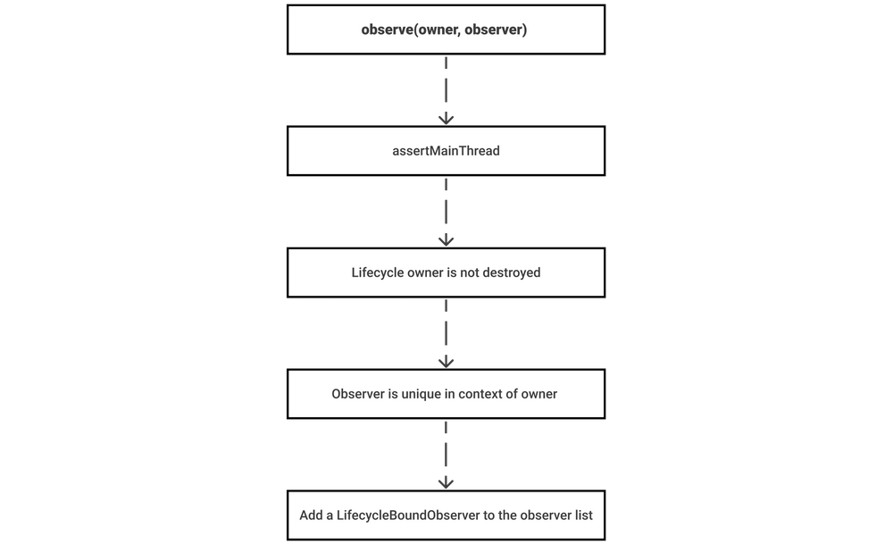

## LiveData: Migrate from LiveData to StateFlow and SharedFlow

> 이 글은 Alex Zhukovich의 [Migrate from LiveData to StateFlow and SharedFlow](https://alexzh.com/migrate-from-livedata-to-stateflow-and-sharedflow/)을 번역 하였다. 

- LiveData 관련 글 
  - [LiveData under the hood](https://alexzh.com/livedata-under-the-hood/) / [번역 글](https://github.com/ksu3101/TIL/blob/master/Android/210128_android.md)
  - [LiveData: Good practices](https://alexzh.com/livedata-good-practices/) / [번역 글](https://github.com/ksu3101/TIL/blob/master/Android/210129_android.md)
  - [Migrate from LiveData to StateFlow and SharedFlow](https://alexzh.com/migrate-from-livedata-to-stateflow-and-sharedflow/) / [번역 글](https://github.com/ksu3101/TIL/blob/master/Android/210201_android.md)

> 이 글에서 수집(collect)은 observing 가능한 객체를 구독(subscribe)하는 것 과 동일 하게 생각 하면 될거 같다. 

LiveData는 가장 널리 사용되는 Android jetpack 컴포넌트 중 하나 이다. 최근 LiveData는 많이 사용 되고 있기는 하지만 몇가지 제한사항이 있어 이 글에서는 그 부분에 대해서 설명하고자 한다. 

이 글에서는 LiveData문제를 해결하고 추가적인 이점을 위해 LiveData대신 Kotlin Flow의 StateFlow와 SharedFlow로 대체 할 것을 제안 하려 한다. 

> Kotlin의 Flow는 값을 순차적으로 내보내고 정상 또는 예외로 완료되는 비동기 데이터 스트림이다. 자세한 내용에 대해서는 [이 문서](https://kotlin.github.io/kotlinx.coroutines/kotlinx-coroutines-core/kotlinx.coroutines.flow/-flow/)에서 더 많은것들을 확인 해 보자.

Kotlin Flow에 익숙하지 않은 경우 [공식 문서](https://kotlinlang.org/docs/reference/coroutines/flow.html)에서 더 자세한 
내용을 읽어볼 수 있다. 

### Problems with LiveData

LiveData는 많은 안드로이드 앱 에서 사용되고 있지만 구조적으로 단점이 존재 한다. 

#### LiveData는 메인스레드에서만 읽고 쓸 수 있는 구조이다 

메인 스레드에서 값을 변경할 수 있더라도 LiveData의 값은 내부적으로 메인스레드에서 업데이트 된다. 


이는 우리가 LiveData객체를 업데이트 하고 싶을 때 스레드를 워커스레드 에서 메인 스레드로의 변경을 의미 한다. 

LiveData객체의 값을 읽는 경우에도 동일한 상황이 발생 한다. `observe()`메소드의 내부 구현을 확인 하면 이 메소드는 메인 스레드에서만 사용할 수 있음을 알 수 있다. 



### Advantages of StateFlow

> StateFlow는 활성된 인스턴스가 콜렉터(collector)의 존재와 상관없이 존재 하기 때문에 How flow이다. 그리고 현재 값은 `value`프로퍼티를 통해서 얻을 수 있다. 또한, StateFlow는 완료되지 않는다. StateFlow에 대한 `Flow.collect()`호출은 정상적으로 완료되지 않으며 `Flow.launchIn()`함수로 시작된 코루틴도 마찬가지 이다. 여기에서 StateFlow의 활성된 Collector는 구독자(subscribe)라고 하기도 한다. 

StateFlow에 대해 자세히 알고 싶으면 [이 글](https://kotlin.github.io/kotlinx.coroutines/kotlinx-coroutines-core/kotlinx.coroutines.flow/-state-flow/)을 참고 하도록 하자.

StateFlow는 LiveData가 가진 문제를 해결할 수 있다. 

### Replacing LiveData with Flow 

ViewModel클래스에서 LiveData객체를 사용하는 가장 잘 알려진 두가지 방법이 있다. 

- 관찰(observing) 가능한 방출된 값 또는 최근 사용 가능한 값 (LiveData)
- 단 한번만 관찰(observing)가능한 한 경우 (SingleLiveEvent)

`SingleLiveData`는 값을 한번만 받고 싶을 때 사용 된다. 일반적으로 경고 메시지나 작업(특정 화면으로 이동)을 할 때 사용 된다. 

예제로 "작업 관리자(Task Manager)"앱 에서 작업 하고 있으며 `TaskViewModel`클래스에서 다음과 같은 경우를 처리 하는 상황을 보도록 하자. 

- 예제 앱 에서는,
  - 모든 "작업"을 보여준다. 
  - 작업 세부 정보 화면으로 이동 시, 해당 "작업"을 방출(emmit)한다. 

```kotlin
class TasksViewModel(
    private val taskRepository: TaskRepository
) : ViewModel() {
    private val _uiState = MutableLiveData<UiState<List<Task>>>()
    val uiState: LiveData<UiState<List<Task>>>
        get() = _uiState

    val action = SingleLiveEvent<Action>()

    fun loadData() {
        _uiState.value = UiState.Loading
        viewModelScope.launch {
            taskRepository.getAllTasks().collect {
                _uiState.value = UiState.Success(it)
            }
        }
    }
    
    ...   
}
```

여기에서 차이점은 `uiState`객체의 값을 옵저빙 할 때 객체의 변경 사항과 화면 회전 후 마지막으로 방출했던 값을 수신하고 싶은 것 이다. `action`객체의 값을 옵저빙 하는 경우 객체가 방출 될 때만 알림을 받고 싶을 수 있다. 이 두 경우 모두에서 LiveData객체를 StateFlow및 SharedFlow로 대체 하는 방법에 대해서 알아 보자. 

### Collect the lastest emitted data

객체가 변경 될 때 알림을 받고 화면 회전 후 마지막으로 방출된 값을 받아 Activity/Fragment를 다시 시작 하게 될 때 `LiveData<T>`를 `StateFlow<T>`로 변경 할 수 있다. 하지만 StateFlow에는 초기 값이 필요 하다. 

```kotlin
class TasksViewModel(
    private val taskRepository: TaskRepository
) : ViewModel() {
    private val _uiState = MutableStateFlow<UiState<List<Task>>>(UiState.Loading)
    val uiState: StateFlow<UiState<List<Task>>>
        get() = _uiState

    fun loadData() {
        _uiState.value = UiState.Loading
        viewModelScope.launch {
            taskRepository.getAllTasks().collect {
                _uiState.value = UiState.Success(it)
            }
        }
    }
    
    ...
}
```

따라서 이 경우 `UiState.Loading`은 `uiState`객체의 초기 값이 된다. ViewModel에서 정확한 값이 방출되고 화면 회전을 변경한 후 이 값은 사용 가능한 마지막 값으로 다시 방출 되어진다. 

이번에는 Fragment에서 값을 수집(collect) 해보도록 하자. 

```kotlin
class TasksFragment : Fragment(R.layout.fragment_tasks) {
    ...

    private fun observeData() {
        viewLifecycleOwner.lifecycleScope.launch {
            tasksViewModel.uiState.collect {
                handleUiState(it)
            }
        }
        ...
    }
    
    ...
}
```

### Collect emitted data once

데이터를 한번만 수집(collect)하려는 경우 `SharedFlow`가 좋은 선택이 될 것 이다. 

> SharedFlow는 모든 Collector가 내 보낸 값을 브로드캐스트방식으로 모두 공유 하는 how Flow 이다. 활성된 인스턴스가 Collector의 존재 여부와 상관없이 존재 하기 때문에 이 shared flow는 hot 이라고 한다. 

SharedFlow에 대해 자세히 알고 싶다면 [이 글](https://kotlin.github.io/kotlinx.coroutines/kotlinx-coroutines-core/kotlinx.coroutines.flow/-shared-flow/)을 참고 하도록 하자. 

값을 수집(collect)할 수 있는 횟수를 매개변수로 하여 수집 횟수를 설정할 수 있는 방법으로 SharedFlow를 구성할 수 도 있다. 

이제 `SingleLiveEvent<T>`에서 `SharedFlow<T>`로 변경 해 보도록 하자. 

```kotlin
class TasksViewModel(
    private val taskRepository: TaskRepository
) : ViewModel() {
    private val _action = MutableSharedFlow<Action>(replay = 0)
    val action: SharedFlow<Action>
        get() = _action

    fun openDetails() {
        ...
        viewModelScope.launch {
            _action.emit(Action.NAVIGATE_TO_DETAILS)
        }
    }
    
    ...
}
```

마지막으로 Fragment도 업데이트 해주도록 한다. 

```kotlin
class TasksFragment : Fragment(R.layout.fragment_tasks) {
    ...

    private fun observeData() {
        viewLifecycleOwner.lifecycleScope.launch {
            tasksViewModel.action.collect {
                handleAction(it)
            }
        }
        ...
    }
    
    ...
}
```

화면 회전이 발생하면 `SharedFlow`와 `replay = 0`매개 변수의 조합으로 인하여 값이 한번 더 collect 되지 않는다. 

### Summary

`LiveData<T>`는 Jetpack의 일부이기 때문에 많은 앱에서 사용되고 있으며 이 컴포넌트는 앱의 UI상태를 업데이트 하는데 사용하기 쉽다. 하지만 이 컴포넌트에는 아래와 같은 문제가 존재 한다. 

- LiveData는 메인 스레드에서만 읽고 쓸 수 있다. 

그리나 이미 Kotlin Flow를 사용하고 있다면 LiveData를 StateFlow및 SharedFlow로 쉽게 대체 할 수 있으며 다음과 같은 추가 이점을 얻을 수 있다. 

- StateFlow와 SharedFlow는 서로 다른 코루틴 컨텍스트에서 읽고 쓸 수 있다. 
- StateFLow는 초기값을 지원 한다.
- StateFlow와 SharedFlow는 모두 map, zip, filter등 과 같은 Flow operation함수들을 지원 한다. 